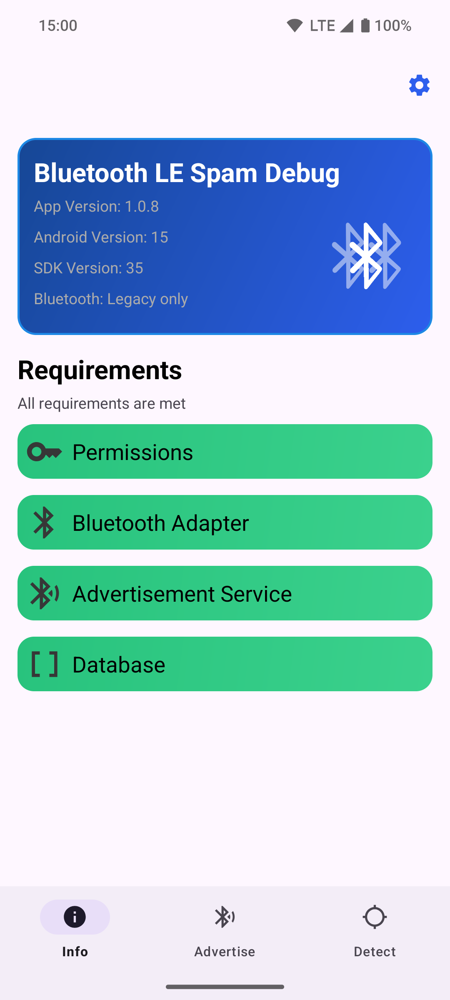
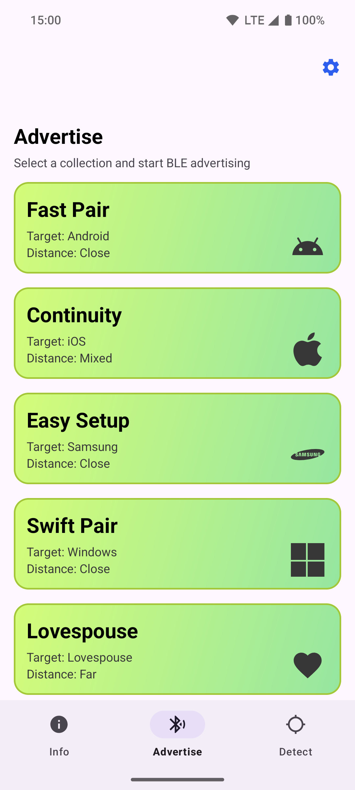
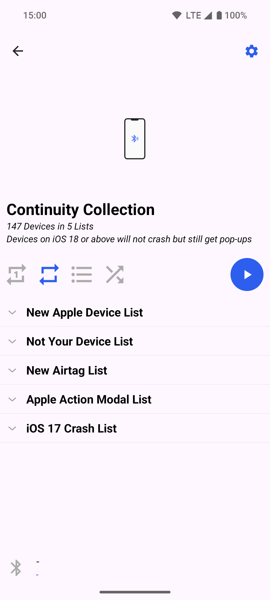
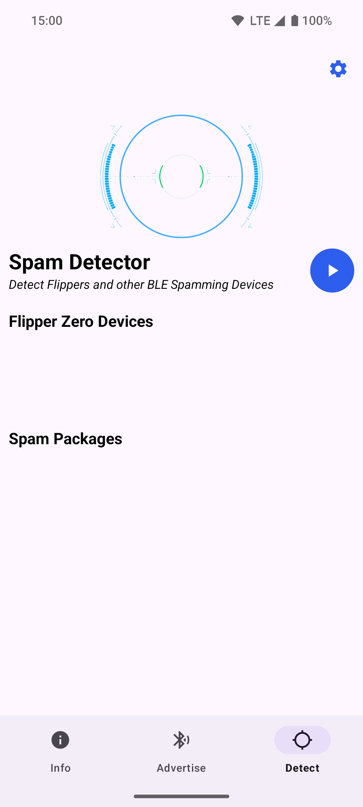

# Bluetooth LE Spam 

This project uses the built-in Bluetooth Low Energy (BLE) functionality built into Android devices
to create Phantom Bluetooth Device Advertisements, similar to what is known, for instance, in the case of the Flipper Zero.
While other apps are available that provide similar functionality, the objective of this app is to enhance convenience and user-friendliness in the process.

#### [For Support, Join the Discord Server](https://discord.gg/x4e4Gma585)

> [!NOTE]
> This project is not actively updated due to no further optimizations to the exploit.
> Contributions from anyone are appreciated.   

## Requirements

- Android 8.0 (API level 26) or later

> [!TIP]
> If you don't know your API level visit [SDK Platform release notes](https://developer.android.com/tools/releases/platforms).
> You also can view your Android version in the Info tab in settings.

- You can not run the app on IOS or PC (even with emulators/VM's)

## Functionality

Sending BLE advertisements (Pop-Ups)

 
This app can send BLE advertisements that mimic the usage of various services.
This can cause nearby devices that listen to such advertisements to show unwanted popup dialogs.

Supported services are:

- Apple (new device popups, various action modals)
- [Microsoft Swift Pair](https://learn.microsoft.com/en-us/windows-hardware/design/component-guidelines/bluetooth-swift-pair) (Windows Devices)
- Samsung Easy Setup

End of life services are:
- [Google Fast Pair](https://developers.google.com/nearby/fast-pair/landing-page) (Android devices) -- patched on modern devices
  
You can send BLE advertisements for all services or for selected targets only.

#### Apple iOS 17 Crash (patched)

With some modifications to the advertised BLE package, it is possible to trigger a reboot in various iOS 17 devices.
This causes the targeted iPhone to temporarily freeze for a few minutes before automatically restarting.

This is reported to be partially patched in iOS 17.2, and fully patched in iOS 18.

> [!NOTE]
> To achieve optimal results, it is recommended to set the advertising interval to a value between 20 and 100 milliseconds.
> Additionally, locking and unlocking the targeted iPhone can aid in the process.

#### Lovespouse (Adult Toys)

With these BLE advertisements, it is possible to enable and disable various adult toys that support the Lovespouse app.
Additionally, the "Denial of Pleasure" can be executed by selecting the Lovespouse Stops List and setting the repeat mode to Repeat List.
More information on this topic can be found [here](https://mandomat.github.io/2023-11-13-denial-of-pleasure/).

### Spam Detector

The Spam Detector tool allows you to detect nearby spammers, even on the lock screen.
It can identify spam from Flipper Zeros, our app, and various other software and scripts.
Once your device has detected spam, it will send you a notification, indicating whether it was sent by a Flipper Zero or another source.

> [!NOTE]
> Location permission and background location access are required for this feature to work.
> These permissions are necessary because Android mandates them for Bluetooth scanning in the background.
> It's important to note that the app will NOT collect your location data.

## Range

The range of Bluetooth Low Energy (BLE) can vary between devices.
Some may have a long range, while others may have a short range.

Android's Bluetooth Low Energy API allows apps to set the TX Power level and include it in the advertiser's payload.
However, it doesn't permit direct modification of the byte values actually transmitted in the payload.
This limitation affects the range of the Fast Pair functionality.
Receiving devices calculate the transmitter's proximity based on the actual received signal strength and the transmitted byte in the payload, which contains the TX Power level the transmitter used.

Devices like the Flipper Zero, however, have the capability to modify this byte, significantly extending their range.

## Installation

You can get installable APK files from the [Github Releases](https://github.com/simondankelmann/Bluetooth-LE-Spam/releases)
and from from [F-Droid](https://f-droid.org/packages/de.simon.dankelmann.bluetoothlespam/).
You can clone the git repo and also build the app yourself.

If you are an end-user looking for a fully functional app, download the Release APK for optimal performance (simply go for this one).
If you are a developer or tester, opt for the Debug APK for testing and debugging purposes.

## Credits

- [mh from mobile-hacker.com](https://www.mobile-hacker.com/author/boni11/) for the [Article / Guideline](https://www.mobile-hacker.com/2023/09/07/spoof-ios-devices-with-bluetooth-pairing-messages-using-android/) about using the nRF Connect App to Spoof iOS Devices
- [Willy-JL](https://github.com/Willy-JL), [ECTO-1A](https://github.com/ECTO-1A), [Spooks4567](https://github.com/Spooks4576) and [Mrproxy](https://github.com/Mr-Proxy-source) for their contribution in the BLE Spam App on the Flipper Zero
- [FuriousMAC](https://github.com/furiousMAC) and [Hexway](https://github.com/hexway) for their prior researches
- [mandomat](https://mandomat.github.io/aboutme/) for the research of [Denial of Pleasure](https://mandomat.github.io/2023-11-13-denial-of-pleasure/)
- [tutozz](https://github.com/tutozz) for the research of Easy Setup Buds in Android
- [K3YOMI](https://github.com/K3YOMI) for the spam detector idea
- [Glorious Gizmos](https://www.tiktok.com/discover/glorious-gizmos) for making content and tutorials on our app
- And special thanks to anyone else who has been involved in prior research and publications related to this topic.

## Screenshots

## Disclaimer

Disclaimer for Bluetooth Low Energy Protocol Investigation Repository

This repository contains code for the investigation and experimentation of the Bluetooth Low Energy (BLE) protocol.
Please be aware of the following disclaimers before using or contributing to this repository:

1. Purpose: The code and information provided in this repository are intended for educational and research purposes and is just a proof of concept.
   It is not intended for any malicious or harmful activities.

2. Legal Compliance: Users are responsible for ensuring that their use of the code and information in this repository complies with all applicable laws and regulations, including those governing wireless communication and intellectual property rights.

3. No Warranty: The code and information provided in this repository are provided "as is" without any warranties, expressed or implied.
   The authors and contributors are not responsible for any consequences resulting from the use of this code.

4. Risks: Experimenting with BLE protocols can have potential security and privacy implications.
   Users should exercise caution and use this code responsibly, respecting the privacy and security of devices and systems.

5. Contribution Guidelines: If you contribute to this repository, ensure that your contributions comply with the project's goals and the repository's license.
   By contributing, you agree to license your contributions under the same license as this repository.

6. Support: This repository is not maintained for production use.
   The authors and contributors may not provide support or updates regularly.

By using and contributing to this repository, you agree to these disclaimers and guidelines.
If you do not agree, please refrain from using or contributing to this repository.

For any questions or concerns, please contact the repository maintainers on Discord or Github.
