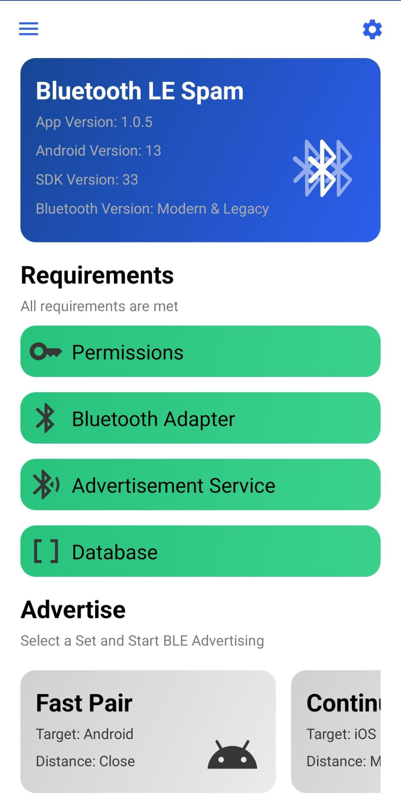
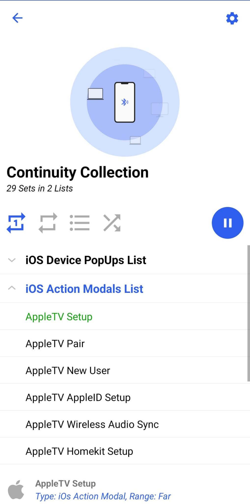
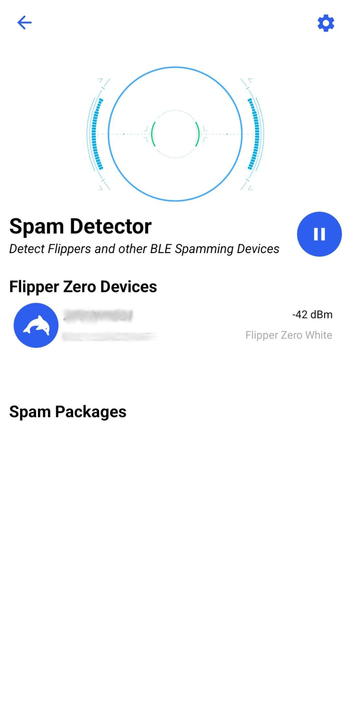
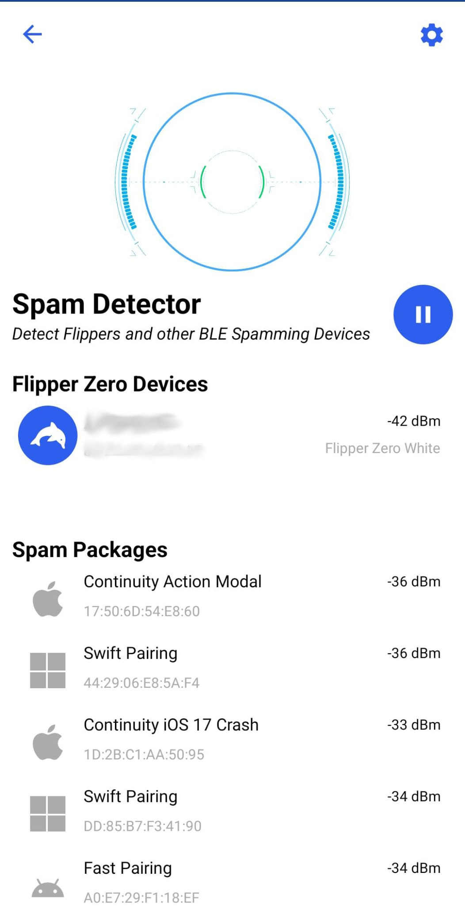
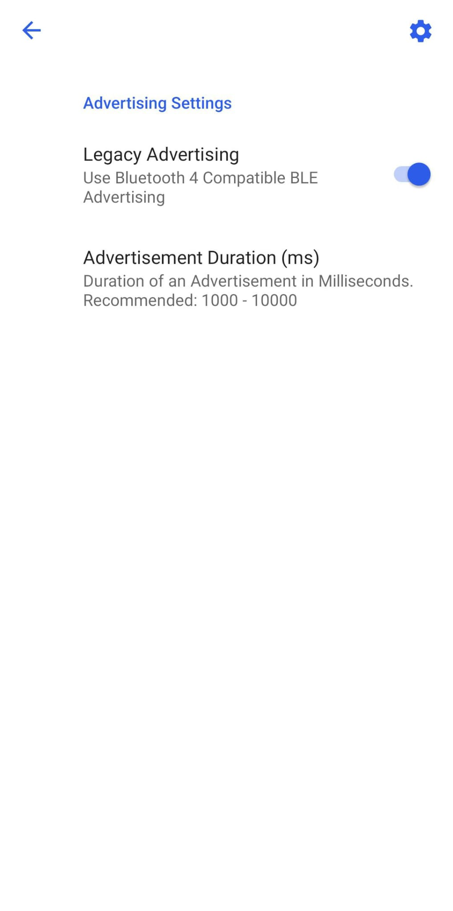

# Bluetooth LE Spam 

This project focuses on utilizing the built-in Bluetooth Low Energy (BLE) functionality of Android smartphones to create Phantom Bluetooth Device Advertisements, similar to what is known, for instance, in the case of the Flipper Zero. While there are other apps available that provide similar functionality, the objective of this app is to enhance convenience and user-friendliness in the process.

> [!NOTE]
> This project is in its early stages of development.  
> Contributions from anyone are welcome.  
> Therefore, the app is currently quite unreliable, and there isn't much we can do about it.

#### [Join the Discord Server](https://discord.gg/x4e4Gma585)

## Requirements
- Android 8.0 (API level 26) or later
> [!TIP]
> If you don't know your API level visit [SDK Platform release notes](https://developer.android.com/tools/releases/platforms).
> You also can view your Android version in the Info tab in settings.
- (Does not support running on IOS or PC)

## Functionality
### Google Fast Pair (Android Devices)
This app is capable of spoofing BLE advertisers that mimic the usage of the Google Fast Pair Service, leading to an influx of unwanted pop-up notifications on the receiving device.

For additional information about the Google Fast Pair Service, you can find it [here](https://developers.google.com/nearby/fast-pair/landing-page)

### Microsoft Swift Pair (Windows Devices)
This app can spoof BLE advertisers that mimic devices supporting the Microsoft Swift Pairing Service. If Swift Pair notifications are enabled on a nearby Windows 10 (or later) device, it will receive a flood of notifications regarding nearby devices.

For additional information about the Microsoft Swift Pair Service, you can find it [here](https://learn.microsoft.com/en-us/windows-hardware/design/component-guidelines/bluetooth-swift-pair)

### Easy Setup (Samsung)
With the Easy Setup functionality, the app is capable of generating Bluetooth Low Energy Advertisement Sets that will trigger popups on Samsung devices specifically.

### Apple Device Popups (Apple devices)
This app can spoof various Apple devices via Bluetooth Low Energy, which can be detected by iOS devices, resulting in a flood of unwanted popups on the receiving iOS device.

### Apple Action Modals (Apple)
By spoofing Bluetooth Low Energy advertisers, this app can prompt iOS devices to open unwanted modals and popups, imitating certain Apple-specific actions.

### Apple iOS 17 Crash (Apple) SEMI-PATCHED
With some modifications to the advertised BLE package, it is possible to trigger a reboot in various iOS 17 devices. This causes the targeted iPhone to temporarily freeze for a few minutes before automatically restarting. (iOS Crash is considered half-fixed due to the release of iOS 17.2 , it may still work on some devices.).

> [!NOTE]
> To achieve optimal results, it is recommended to set the advertising interval to a value between 20 and 100 milliseconds. Additionally, locking and unlocking the targeted iPhone can aid in the process.

### Lovespouse (Adult Toys)
With this functionality, it is possible to enable or disable various adult toys that support the Lovespouse app. Additionally, the "Denial of Pleasure" can be executed by selecting the Lovespouse Stops List and setting the repeat mode to Repeat List. More information on this topic can be found [here](https://mandomat.github.io/2023-11-13-denial-of-pleasure/).

### Kitchen Sink (Everything at once)
Utilizing this functionality, the app randomly generates BLE advertisement packages based on all other features. This leads to the highest number of affected devices in the vicinity.

### Spam Detector (Detect Spammers)
The Spam Detector tool allows you to detect nearby spammers, even on the lock screen. It can identify spam from Flipper Zeros, our app, and various other software and scripts. Once your device has detected spam, it will send you a notification, indicating whether it was sent by a Flipper Zero or another source.

> [!NOTE]
> Location permission and background location access are required for this feature to work.
> These permissions are necessary because Android mandates them for Bluetooth scanning in the background.
> It's important to note that the app will NOT collect your location data.

## Range
Simply put, the range of Bluetooth Low Energy (BLE) can vary between devices; some may have a long range, while others may have a short range.

The official Bluetooth Low Energy API provided by Google's Android SDK allows you to set the TX Power level and include it in the advertiser's payload. However, it doesn't permit direct modification of the byte values actually transmitted in the payload. This limitation affects the range of the Fast Pair functionality. Receiving devices calculate the transmitter's proximity based on the actual received signal strength and the transmitted byte in the payload, which contains the TX Power level the transmitter used.

Devices like the Flipper Zero, however, have the capability to modify this byte, significantly extending their range.

## Installation
You can clone the repository and open it in Android Studio to install the app, or simply use the installable APK files from the [Release Section](https://github.com/simondankelmann/Bluetooth-LE-Spam/releases). You can also download it from F-Droid [here](https://f-droid.org/packages/de.simon.dankelmann.bluetoothlespam/).

If you're an end-user looking for a fully functional app, download the Release APK for optimal performance (simply go for this one). If you're a developer or tester, opt for the Debug APK for testing and debugging purposes.

## Credit
- [mh from mobile-hacker.com](https://www.mobile-hacker.com/author/boni11/) for the [Article / Guideline](https://www.mobile-hacker.com/2023/09/07/spoof-ios-devices-with-bluetooth-pairing-messages-using-android/) about using the nRF Connect App to Spoof iOS Devices

- [Willy-JL](https://github.com/Willy-JL), [ECTO-1A](https://github.com/ECTO-1A), [Spooks4567](https://github.com/Spooks4576) and [Mrproxy](https://github.com/Mr-Proxy-source) for their contribution in the BLE Spam App on the Flipper Zero

- [FuriousMAC](https://github.com/furiousMAC) and [Hexway](https://github.com/hexway) for their prior researches

- [mandomat](https://mandomat.github.io/aboutme/) for the research of [Denial of Pleasure](https://mandomat.github.io/2023-11-13-denial-of-pleasure/)

- [tutozz](https://github.com/tutozz) for the research of Easy Setup Buds in Android

- [K3YOMI](https://github.com/K3YOMI) for the spam detector idea

- And special thanks to anyone else who has been involved in prior research and publications related to this topic.

## Screenshots

## Disclaimer
Disclaimer for Bluetooth Low Energy Protocol Investigation Repository

This repository contains code for the investigation and experimentation of the Bluetooth Low Energy (BLE) protocol. Please be aware of the following disclaimers before using or contributing to this repository:

1. Purpose: The code and information provided in this repository are intended for educational and research purposes and is just a proof of concept. It is not intended for any malicious or harmful activities.

2. Legal Compliance: Users are responsible for ensuring that their use of the code and information in this repository complies with all applicable laws and regulations, including those governing wireless communication and intellectual property rights.

3. No Warranty: The code and information provided in this repository are provided "as is" without any warranties, expressed or implied. The authors and contributors are not responsible for any consequences resulting from the use of this code.

4. Risks: Experimenting with BLE protocols can have potential security and privacy implications. Users should exercise caution and use this code responsibly, respecting the privacy and security of devices and systems.

5. Contribution Guidelines: If you contribute to this repository, ensure that your contributions comply with the project's goals and the repository's license. By contributing, you agree to license your contributions under the same license as this repository.

6. Support: This repository is not maintained for production use. The authors and contributors may not provide support or updates regularly.

By using and contributing to this repository, you agree to these disclaimers and guidelines. If you do not agree, please refrain from using or contributing to this repository.

For any questions or concerns, please contact the repository maintainers on Discord or Github.
